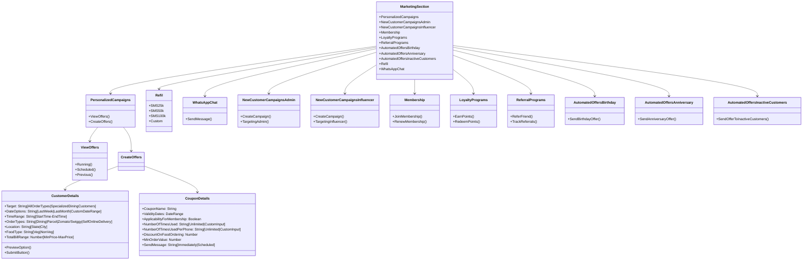

# SmartReach Marketing Hub

## Core Components

### Campaign Modules
- `PersonalizedCampaigns`: Existing customer targeting
- `NewCustomerAdmin`: Admin-managed acquisition campaigns
- `NewCustomerInfluencer`: Influencer campaign management 
- `Membership`: Tier management + benefits
- `LoyaltyPrograms`: Points/rewards system
- `ReferralPrograms`: Referral tracking + rewards 
- `AutoBirthday`: Birthday offer triggers
- `AutoAnniversary`: Anniversary campaign handling
- `AutoInactive`: Re-engagement flow 
- `WhatsAppChat`: Customer messaging interface
- `Refill`: Inventory management system

###`PersonalizedCampaigns`: 
### `PersonalizedCampaigns`: 
Targets existing customers with tailored campaigns.

#### 1. **View Offers**
- **Running Offers**: Active campaigns.
- **Scheduled Offers**: Upcoming campaigns.
- **Previous Offers**: Past campaigns.

#### 2. **Create Offers**
- **Customer Details**:
  - **Targeting**: All Order Types | Specialized Dining Customers.
  - **Date Options**: Last Week | Last Month | Custom Date Range.
  - **Time Range**: Start Time | End Time.
  - **Order Types**: Dining | Parcel | Zomato/Swiggy | Self-Online Delivery.
  - **Location**: State | City.
  - **Food Type**: Veg | Non-Veg.
  - **Total Bill Range**: Min Price | Max Price.
  - **Preview Option**: View before submission.
  - **Submit**: Finalize offer.
  
- **Coupon Details**:
  - **Coupon Name**: Name of the offer.
  - **Validity Dates**: Start & End dates.
  - **Membership Applicability**: Yes/No.
  - **Usage Limits**: Total Uses | Per Phone Number (Unlimited | Custom Input).
  - **Discount**: Percentage off.
  - **Min Order Value**: Minimum required order.
  - **Send Message**: Immediately | Scheduled.
 

